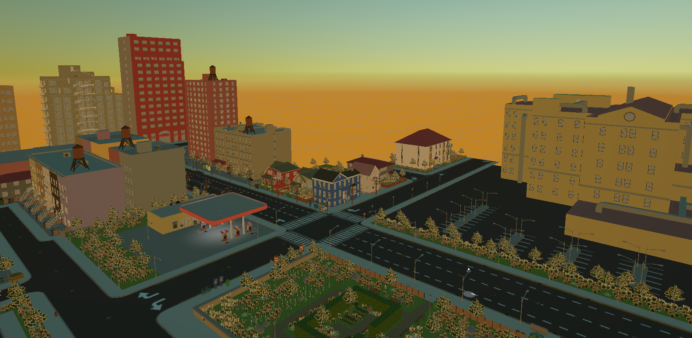

# 💡 Unity 3D Lighting Study

A small Unity project focused on creating realistic lighting, shadows and atmosphere in an indoor environment.

---

## 📸 Preview

---

## ✨ Features

- Real-time Lighting
- Baked Global Illumination
- Reflection Probes
- Post Processing
- Interior Environment
- Ambient Lighting
- Shadow Optimization

---

## 🛠️ Built With

- Unity 2022 LTS
- Universal Render Pipeline (URP)
- C#

---

## 🎯 Purpose

This project was created to improve my knowledge of lighting techniques and environment design in Unity.

---

## 👩‍💻 Author

**Emine Yaman**

Game Developer & UI/UX Designer
